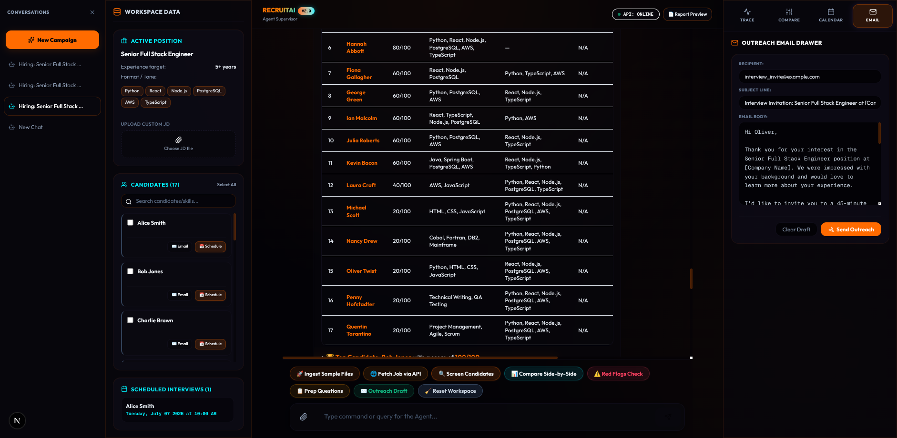
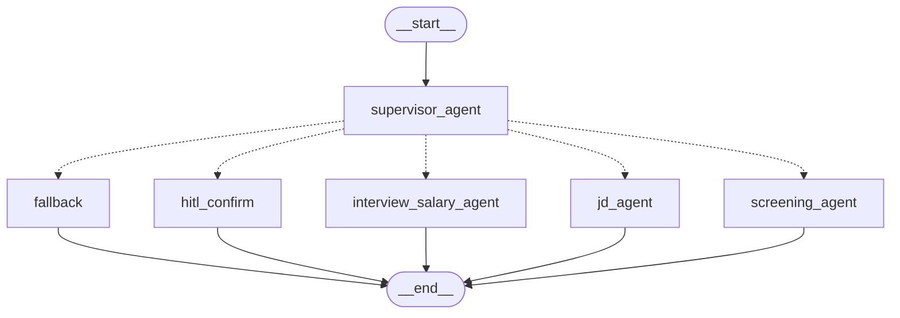

# RecruitAI



PPT: https://canva.link/vhjbsmm3ggyqaf6  
Video Demo: https://drive.google.com/drive/folders/1LqA2B1YfSbc-91-OUlOwBDksLj5RAYDc?usp=sharing

**RecruitAI** is a production‑grade, Multi-Agent recruitment chatbot built for the AI Bootcamp Hackathon. It lets a recruiter load job descriptions (JD) and dynamic resumes (PDF, DOCX, TXT), then interactively query the system to:

- Count the number of loaded candidates without LLM overhead.
- Screen and rank candidates against the JD using **Advanced RAG** (Query Expansion + LLM-assisted Chunks Reranking).
- Generate JDs, technical/behavioral interview questions, and live salary benchmarks.
- Finalise a short‑list with human‑in‑the‑loop confirmation.
- Generate and download styled corporate recruitment PDF reports and previews.
- **Diagnostics & JD Enhancements:** Spot experience mismatches and missing JD fields (location, salary, benefits).
- **Candidate Comparison Matrix:** View side-by-side matrices comparing experience, scores, matching skills, gaps, and flags.
- **Email Outreach Drafter:** Review, edit, and send invite, rejection, or offer emails using a custom LangChain `@tool`.
- **Visual Scheduler:** Book slots dynamically on an interactive calendar grid.
- **Resume Red-Flag Auditor:** Audit resumes automatically for timeline gaps (>6 months) and job-hopping.

The system is built on **LangChain** and **LangGraph**, utilizing a **Multi-Agent Supervisor** delegation pattern.

---

## Table of Contents

1. [Overview & Agent Architecture](#overview--agent-architecture)
2. [Advanced RAG Pipeline](#advanced-rag-pipeline)
3. [Technical Stack](#technical-stack)
4. [Setup & Installation](#setup--installation)
5. [Running RecruitAI](#running-recruitai)
6. [Project Structure](#project-structure)
7. [Testing & Verification](#testing--verification)

---

## Overview & Agent Architecture

RecruitAI uses a state-of-the-art **Multi-Agent Supervisor** architecture implemented in LangGraph:

- **Supervisor Agent:** Acts as the entrance hub. It analyzes conversation history, classifies user intent, and delegates control to the correct specialized worker.
- **JD Agent:** Manages Job Description loading, parsing, context rewriting, and live job description fetching via SerpApi/IndianAPI.
- **RAG Screening Agent:** Handles semantic resume search (pgvector), candidate ranking, plain candidate counting, side-by-side candidate comparisons, and resume red-flag detection.
- **Interview & Salary Agent:** Generates custom technical/behavioral prep questions, queries market salary benchmarks, schedules interview calendar slots, and drafts recruiter emails.
- **Human-in-the-Loop Node:** Restricts candidate shortlist finalization and interview booking behind explicit user confirmation.

### Workflow Visualization Diagram



---

## Advanced RAG Pipeline

Instead of a basic semantic vector query, RecruitAI implements an **Advanced RAG** pipeline:

1. **Query Translation:** Expands the user's screening prompt with synonyms, alternative terms, and related skills using LLM translation to improve recall.
2. **Dense Retrieval:** Retrieves the top 5 chunks per candidate from Supabase pgvector using cosine similarity.
3. **LLM Reranking:** Evaluates retrieved chunks, scoring each 1-10 on relevance. Retains only the top 3 most relevant chunks to eliminate noise and save LLM token usage during candidate evaluations.

---

## Technical Stack

| Layer               | Technology                                   | Description                                   |
| ------------------- | -------------------------------------------- | --------------------------------------------- |
| Orchestration       | **LangGraph** (Python)                       | Multi-Agent state machines and transitions    |
| LLM Framework       | **LangChain** (`langchain-core`)             | Standardized models, messages, and runnables  |
| Model Integrations  | **Gemini** (`ChatGoogleGenerativeAI`) + **Groq** (`ChatGroq`) | Round-robin distribution with automatic failover |
| Document Parsing    | `pypdf` + `python-docx` + **APILayer CV Parser** | Dynamic PDF, DOCX, and TXT parsing            |
| Embeddings          | `sentence‑transformers` – `all‑MiniLM‑L6‑v2` | 384‑dim vector embedding generation           |
| Vector Store        | **Supabase** (Postgres + pgVector)           | Cosine similarity candidate vector database   |
| Web Search          | **Tavily**                                   | Lightweight salary & technology trends search |
| Report Generation   | **ReportLab**                                | Styled recruitment summary PDF compilation     |
| UI Frontend         | **Next.js 16** (App Router) + **Tailwind**   | Slate-themed dashboard, logs trace timeline   |

---

## Setup & Installation

1. **Create virtual environment** and install dependencies:
   ```bash
   python -m venv .venv
   .venv\Scripts\activate   # Windows
   pip install -r backend/requirements.txt
   ```
2. **Configure environment variables**:
   - Copy `backend/.env.example` to `backend/.env`.
   - Fill in the API keys for Gemini, Groq, Tavily, and Supabase.
   ```text
   GEMINI_API_KEY=your_gemini_key
   GROQ_API_KEY=your_groq_key
   TAVILY_API_KEY=your_tavily_key
   SUPABASE_URL=your_supabase_url
   SUPABASE_SERVICE_ROLE_KEY=your_service_role_key
   
   # Phase 11 Real API Integrations
   SERPAPI_API_KEY=your_serpapi_key
   APILAYER_API_KEY=your_apilayer_cv_parser_key
   ```
3. **Initialize Supabase table**:
   - Run the DDL provided in `backend/scripts/init_db.sql` via psql or your Supabase SQL editor.

---

## Running RecruitAI

Run the interactive launcher:
```bash
python backend/run.py
```
Choose:
- `1` for the **FastAPI REST Server** (connects to the Next.js visual dashboard).
- `2` for the **CLI Terminal Chatbot** (interactive REPL).

### Running the Frontend
```bash
cd frontend
npm run dev
```
Open `http://localhost:3000` to interact with the dashboard: upload resumes, chat with the multi-agent system, compare candidates, schedule slots, trace agent hops, and download styled reports.

---

## Project Structure

```
RecruitAI/
├─ backend/                     # Python backend (core logic)
│  ├─ app/                     # FastAPI style package
│  │  ├─ core/                 # config, logging, LLM router (LangChain wrappers)
│  │  ├─ graph/                # LangGraph state, Multi-Agent Supervisor nodes
│  │  │  ├─ nodes/             # graph nodes (parse, count, screen, redflags, schedule, email)
│  │  ├─ rag/                  # chunking, embeddings, vector store, Advanced RAG
│  │  ├─ services/             # resume loader, report generator, live API services (job_desc_api, resume_api)
│  │  ├─ schemas/              # Pydantic models (JobDescription, Candidate)
│  │  ├─ tools/                # Tavily salary search tool, custom email tool, trend tool
│  │  ├─ api/                  # HTTP endpoints (chat, reports, ingestion)
│  │  └─ cli.py                # REPL entry point
│  ├─ data/                    # Sample JD, resumes, salary fallback
│  ├─ tests/                   # pytest suite covering nodes, RAG, failovers, Phase 10 & 11 features
│  ├─ scripts/                 # DB init script
│  └─ requirements.txt         # Dependency list
├─ frontend/                    # Next.js 16 dashboard UI
│  ├─ src/                     # App router page and custom Markdown renderer
│  └─ package.json
├─ PLAN.md                    # blueprint
└─ README.md                  # **You are reading it**
```

---

## Testing & Verification

Run the comprehensive test suite covering all modules:
```bash
pytest
```
Includes:
- Schema validation (`tests/test_schemas.py`)
- Vector store ingestion (`tests/test_ingestion.py`)
- Graph nodes (`tests/test_nodes.py`)
- FastAPI endpoints (`tests/test_api.py`)
- PDF generation (`tests/test_reports.py`)
- File uploads (`tests/test_upload.py`)
- Query expansion & Reranking (`tests/test_advanced_rag.py`)
- LLM Round-Robin Failover (`tests/test_failover.py`)
- Phase 10 Features (Comparison, Scheduler, Email Tool, Red Flags, Trends) (`tests/test_phase10.py`)
- Phase 11 Live APIs & Fallbacks (`tests/test_real_api.py`)

---

## Deployment

This application is designed to be deployed as two connected services: a **Next.js Frontend** (on Vercel) and a **FastAPI Backend** (on a container/server hosting service like Render, Railway, Fly.io, or AWS).

### Why the Frontend and Backend are hosted separately
The FastAPI backend utilizes `sentence-transformers` and PyTorch (`all-MiniLM-L6-v2`) to compute high-quality vector embeddings. These machine learning packages require large native binaries (around 800MB) that exceed Vercel's Serverless Function size limit (250MB unzipped). Hosting the backend on a container-based service (like Render or Railway) and the frontend on Vercel is the standard and production-grade solution.

---

### Step 1: Deploy the FastAPI Backend (Render, Railway, etc.)

We have provided a production-ready `Dockerfile` inside the `backend/` directory.

#### Deploying on Render (Web Service):
1. Create a new **Web Service** on Render and connect your GitHub repository.
2. Set the **Root Directory** to `backend`.
3. Set the **Runtime** to `Docker` (Render will automatically detect the `Dockerfile` inside `backend`).
4. Set the instance type (a Starter tier or above is recommended due to PyTorch memory usage).
5. In the **Environment Variables** section of the Render dashboard, add the following keys from your `.env`:
   - `GEMINI_API_KEY`
   - `GROQ_API_KEY`
   - `TAVILY_API_KEY`
   - `SUPABASE_URL`
   - `SUPABASE_SERVICE_ROLE_KEY`
   - `SERPAPI_API_KEY` (if used)
   - `APILAYER_API_KEY` (if used)
   - `SMTP_SERVER`, `SMTP_PORT`, `SMTP_USERNAME`, `SMTP_PASSWORD`, `SMTP_SENDER` (if email functionality is used)
6. Deploy the web service and copy its public URL (e.g., `https://recruit-ai-backend.onrender.com`).

---

### Step 2: Deploy the Next.js Frontend (Vercel)

The frontend is fully configured with Next.js dynamic rewrites. All client requests to `/api/*` are securely proxied server-side to the backend, bypassing browser CORS restrictions.

#### Deploying on Vercel:
1. Create a new Project on Vercel and connect your GitHub repository.
2. In the project configure page, set the **Root Directory** to `frontend`.
3. In the **Environment Variables** section, add:
   - `BACKEND_URL`: The public URL of your deployed backend (e.g. `https://recruit-ai-backend.onrender.com`). Do **not** append `/api` or a trailing slash to this URL.
4. Click **Deploy**. Vercel will build and host your Next.js frontend, routing all API calls to your live backend automatically.