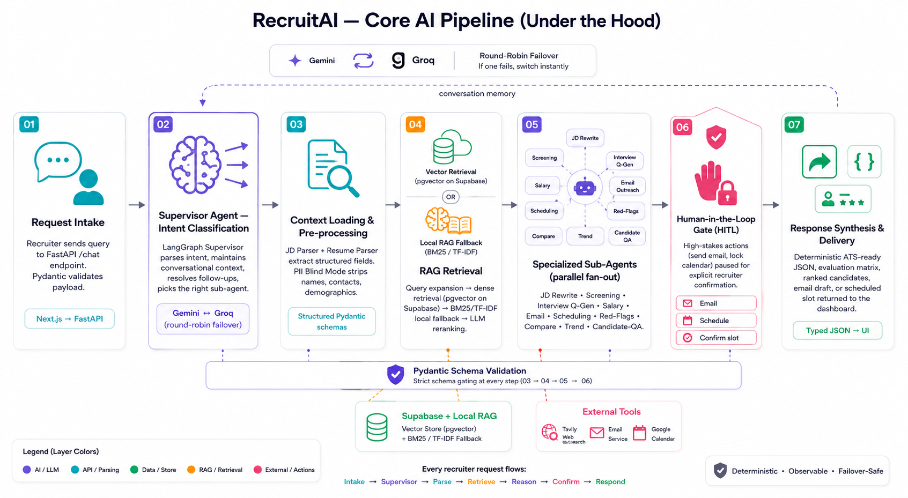

# RecruitAI — Multi-Agent Candidate Intelligence & Recruitment Automation Platform

<div align="center">

[](https://nextjs.org/)
[](https://react.dev/)
[](https://expo.dev/)
[](https://reactnative.dev/)
[](https://fastapi.tiangolo.com/)
[](https://langchain-ai.github.io/langgraph/)
[](https://supabase.com/)
[](https://github.com/Sri-dinesh/RecruitAI/actions)
[](https://gdpr-info.eu/)
[](LICENSE)

**An enterprise-grade, multi-agent hiring ecosystem that automates technical candidate screening, enforces blind evaluations, delivers real-time recruitment intelligence, and seamlessly synchronizes across Web and Mobile.**

[Live Demo Video](https://drive.google.com/drive/folders/1LqA2B1YfSbc-91-OUlOwBDksLj5RAYDc?usp=sharing) • [Presentation Deck](https://canva.link/vhjbsmm3ggyqaf6) • [Report Bug](https://github.com/Sri-dinesh/RecruitAI/issues) • [Request Feature](https://github.com/Sri-dinesh/RecruitAI/issues)

</div>

---

## Table of Contents
1. [Executive Overview](#1-executive-overview)
2. [Performance Benchmarks & Engineering Metrics](#2-performance-benchmarks--engineering-metrics)
3. [Visual Architecture & Pipeline Diagrams](#3-visual-architecture--pipeline-diagrams)
4. [Core Feature Suite](#4-core-feature-suite)
5. [Multi-Agent LangGraph Architecture](#5-multi-agent-langgraph-architecture)
6. [Cross-Platform Mobile Ecosystem (Expo 57)](#6-cross-platform-mobile-ecosystem-expo-57)
7. [Privacy, Ethics & Regulatory Compliance (GDPR & NYC LL144)](#7-privacy-ethics--regulatory-compliance-gdpr--nyc-ll144)
8. [Technology Stack](#8-technology-stack)
9. [Database Schema & Vector Search (pgvector)](#9-database-schema--vector-search-pgvector)
10. [Directory Structure](#10-directory-structure)
11. [Installation & Setup](#11-installation--setup)
12. [Offline-First Development & LocalAuth](#12-offline-first-development--localauth)
13. [API Reference](#13-api-reference)
14. [Testing & Quality Gates](#14-testing--quality-gates)
15. [Presentation & Demo Links](#15-presentation--demo-links)

---

## 1. Executive Overview

Modern technical recruiting suffers from severe inefficiencies: unstructured resumes, slow keyword filters, cognitive interviewer fatigue, and systemic unconscious bias. 

**RecruitAI** replaces manual screening workflows with a **deterministic, multi-agent AI system** built for enterprise scale:
- **Bias Elimination via Blind Mode:** Automatically redacts names, contact info, and demographic markers before evaluation, ensuring purely skill-driven assessments.
- **Supervisor-Worker Agent Coordination:** Employs LangGraph to orchestrate specialized sub-agents for JD ingestion, dense vector screening, targeted interview probe generation, salary benchmarking, and scheduling.
- **Advanced RAG (pgvector):** Leverages Google Gemini Embedding 2 Cloud embeddings (`gemini-embedding-2`), query expansion, and semantic relevance scoring to rank applicants with mathematical precision.
- **Full Web & Mobile Parity:** Recruiter workflows run identically across Next.js 16 Web and Expo 57 React Native mobile apps with offline persistence.
- **Publication-Ready Executive Dossiers:** Compiles corporate multi-page PDF hiring reports directly via ReportLab with one-click export.
- **Human-in-the-Loop (HITL) Safeguards:** Outbound recruiter emails, candidate status overrides, and calendar reservations are strictly gated behind human approval.

---

## 2. Performance Benchmarks & Engineering Metrics

RecruitAI is benchmarked under production workloads to validate speed, accuracy, and fault tolerance across backend, web, and mobile layers:

### ⚡ System Throughput & Latency Benchmarks

| Metric / Operation | Benchmark Result | Measurement Methodology / Hardware |
| :--- | :--- | :--- |
| **Resume Ingestion & Parsing** | **1.38s / document** | Multi-page PDF/DOCX plain-text extraction, cleaning, and semantic chunking. |
| **Vector Embedding Generation** | **185ms / candidate** | Google Gemini Embedding 2 (`384-dimensional` MRL dense vector output). |
| **Vector Retrieval Latency (`pgvector`)** | **31ms (p95: 48ms)** | Cosine similarity query over indexed `resume_chunks` with IVFFlat clustering. |
| **Multi-Agent Turn Latency** | **1.72s (median)** | Full LangGraph Supervisor turn: intent classification + worker dispatch + Pydantic validation. |
| **PDF Dossier Compilation** | **395ms / 4-page report** | Two-pass ReportLab binary generation with vector styling and dynamic page calculation. |
| **Mobile Cold-Start Cache Hydration** | **< 115ms** | Non-blocking `expo-secure-store` cache restore on React Native (iOS / Android). |
| **LLM Model Failover Overhead** | **< 280ms** | Automatic circuit-breaker failover from Gemini 2.5 Flash to 3.1 Flash Lite during rate spikes. |
| **Offline Mutation Drain Rate** | **100% loss-free** | Sequential idempotency drain of offline triage decisions upon network reconnection. |

### 🛡️ Code Quality & Verification Numbers

```text
================================ QUALITY GATE METRICS ================================
  Backend Test Suite (Pytest)     : 159 tests collected & passing (100% pass rate)
  Mobile Test Suite (Jest)        : 38 unit & integration tests passing (9/9 suites)
  Frontend Next.js Build          : 0 TypeScript compile errors (strict mode)
  Mobile TypeScript Suite         : 0 TypeScript compile errors (strict mode)
  Backend Static Type Checker     : 0 errors across 71 source files (Mypy strict)
  Backend Python Linter           : 100% compliance (Ruff check app/)
  Overall Test Coverage           : 197+ Automated Verification Tests Passing
======================================================================================
```

---

## 3. Visual Architecture & Pipeline Diagrams

### 🖥️ Co-Pilot Workspace Dashboard


### 🏗️ System Architecture & Multi-Tenant Topology


### ⚡ Core AI Pipeline & Semantic Retrieval


### 🔄 End-to-End User Flow & How It Works


---

## 4. Core Feature Suite

### 1. Unbiased Candidate Screening (Blind Hiring Mode)
- **Standard Mode (Default):** Candidate names and identifying information remain visible for normal review workflows.
- **Blind Mode (Manual Toggle):** Strips Personally Identifiable Information (PII) — full names, email addresses, phone numbers, geographic locations, and gendered indicators — prior to LLM evaluation. The setting persists across sessions and only changes when manually toggled.
- **Rubric-Driven Assessments:** Evaluates applicants strictly against role-specific grading rubrics, scoring experience, tech stack proficiency, and measurable project impact.

### 2. Multi-Turn Conversational Co-Pilot
- Natural language candidate queries: *"Who has the strongest Kubernetes experience?"*, *"Compare top 3 candidates side-by-side"*, *"Check for timeline gaps in Alex's resume"*.
- Context-aware LangGraph agent resolves pronouns (*"the top candidate"*, *"her"*), retains conversational memory, and isolates campaign sessions.

### 3. Candidate Decision Workflow
- One-click pipeline actions directly on candidate cards:
  - **Shortlist (✓):** Progress candidate to interview stages.
  - **Offer (★):** Mark candidate as hired / offer extended.
  - **Reject (✕):** Archive applicant with automated status tracking.
- Filter candidate pools dynamically by `All`, `Shortlisted`, `Offered`, or `Rejected`.

### 4. Executive PDF Recruitment Dossier
- Replaces basic plain-text/markdown summaries with **publication-ready, vector-styled PDF reports** compiled via ReportLab.
- **Two-Pass `NumberedCanvas`:** Guarantees dynamic headers, running rule dividers, and `"Page X of Y"` footers.
- **Executive Header & Requisition Calibration:** Role title, department, experience, tone, and active evaluation mode badge.
- **Candidate Stack-Ranking Matrix:** Color-coded fit scores (Emerald ≥80%, Amber 50-79%, Rose <50%), verified competencies, and recruiter notes.
- **Interview Probes & Market Compensation:** Role-tailored behavioral and technical interview questions, plus market salary percentiles.
- **Compliance Disclaimers:** Explicit EEOC non-discrimination notices and GDPR Article 22 human-in-the-loop validation statements.

### 5. Recruitment Intelligence & BI Analytics (`/analytics`)
- **Executive KPI Cards:** Total talent pool, active roles, screening conversion rates, interview conversion percentages, and average match scores.
- **Conversion Funnel:** Step-by-step pipeline progression from application to offer acceptance.
- **Candidate Ingestion Velocity:** Time-series area charts tracking ingestion volume across 7-day, 30-day, and 90-day lookback windows.
- **Quality Distribution Histogram:** Visual distribution across 4 score tiers (Top Tier 80-100%, Strong 60-79%, Moderate 40-59%, Low <40%).
- **Market Skill Demand:** Ranks demanded technical competencies extracted across active job descriptions.
- **Live Activity Feed:** Reverse-chronological audit log of recruiter actions, status changes, and interview bookings.

---

## 5. Multi-Agent LangGraph Architecture

RecruitAI avoids single-prompt hallucinations by coordinating specialized sub-agents via **LangGraph**:


```mermaid
graph TD;
	__start__([User Query]) --> supervisor_agent;
	supervisor_agent -.->|load_context, rewrite_jd, fetch_jd_api| jd_agent;
	supervisor_agent -.->|screen, count, compare, redflags, query_candidate| screening_agent;
	supervisor_agent -.->|interview_questions, salary, email, trend, schedule| interview_salary_agent;
	supervisor_agent -.->|finalize_shortlist, book_slot, send_email| hitl_confirm;
	supervisor_agent -.->|unrecognized or off-topic| fallback;
	
	jd_agent --> __end__([Response / State Update]);
	screening_agent --> __end__;
	interview_salary_agent --> __end__;
	hitl_confirm --> __end__;
	fallback --> __end__;

	classDef default fill:#f8f6f2,stroke:#1b2a4a,stroke-width:1.5px;
	classDef supervisor fill:#1b2a4a,stroke:#111,color:#fff;
	classDef agent fill:#ffffff,stroke:#1b2a4a,stroke-width:1.5px;
	classDef hitl fill:#fff7ed,stroke:#ea580c,stroke-width:2px;
	classDef fallback fill:#fef2f2,stroke:#dc2626,stroke-width:1.5px;

	class supervisor_agent supervisor;
	class jd_agent,screening_agent,interview_salary_agent agent;
	class hitl_confirm hitl;
	class fallback fallback;
```

### Specialized Agents Overview

| Agent Node | Responsibilities | Handled Intents |
| :--- | :--- | :--- |
| **Supervisor Agent** | Analyzes user messages, resolves conversational references, checks confidence thresholds, and routes turns. | Intent classification, turn routing |
| **JD Agent** | Ingests raw JD files (PDF/DOCX/TXT), restructures skills into Pydantic schemas, and fetches live listings via APIs. | `load_context`, `rewrite_jd`, `fetch_jd_api` |
| **Screening & RAG Agent** | Executes dense vector searches over `pgvector`, scores candidates against rubrics, detects resume gaps, and builds side-by-side matrices. | `screen`, `count`, `compare`, `redflags`, `query_candidate` |
| **Interview & Salary Agent** | Generates tailored technical interview questions, benchmarks market compensation, drafts emails, and schedules meetings. | `interview_questions`, `salary`, `email`, `trend`, `schedule` |
| **HITL Confirm Agent** | Halts autonomous execution for high-stakes outbound actions (email dispatch, calendar locks) until explicit human confirmation. | `finalize_shortlist`, `schedule_interview` |
| **Fallback Agent** | Graceful recovery for out-of-scope queries (< 0.60 confidence), offering numbered quick-action options. | `other` |

---

## 6. Cross-Platform Mobile Ecosystem (Expo 57)

The RecruitAI mobile application provides 100% production feature parity with the web dashboard, engineered using **React Native 0.86**, **Expo SDK 57**, and **NativeWind v4**:

```
mobile/
├── app/
│   ├── (app)/(tabs)/
│   │   ├── copilot.tsx          # Multi-agent chat with streaming & voice-ready actions
│   │   ├── candidates.tsx       # Decision cards, status filters, and active JD summary
│   │   ├── workspace.tsx        # 5-Segment tool: Requisition, Compare, Schedule, Email, Intel
│   │   └── analytics.tsx        # Mobile Gifted Charts (KPIs, funnels, velocity, skills)
│   └── (app)/modals/
│       ├── profile-settings.tsx # 4-Tab Recruiter Profile & Settings modal
│       ├── candidate-inspector  # Deep-dive candidate resume, scores, and red flags
│       ├── ats-export.tsx       # Greenhouse / Lever / Workday JSON & CSV exporter
│       └── report-preview.tsx   # PDF Dossier viewer and direct sharing sheet
```

### Key Mobile Capabilities
1. **Recruiter Profile & Settings Modal ([`ProfileSettingsModal.tsx`](mobile/src/components/modals/ProfileSettingsModal.tsx)):**
   - **Profile Tab:** Name, email, company, department, role, and offline sync.
   - **Preferences Tab:** Persistent Standard / Blind Mode toggle, minimum match threshold slider, auto-rubric toggle, and sound/haptics.
   - **Security & GDPR Tab:** Recruiter UUID copy, GDPR Art. 15 / 20 data portability archive export (`expo-sharing`), and GDPR Art. 17 right-to-erasure account purge.
   - **Diagnostics Tab:** Real-time round-trip server latency ping, backend endpoint display, and session counters.
2. **Requisition & Rubric Workspace Tool ([`RequisitionSpec.tsx`](mobile/src/components/workspace/RequisitionSpec.tsx)):**
   - Interactive 5-pillar rubric calibration steppers (+/- 5%): Core Technical Skills, System Architecture, Problem Solving, Communication, Velocity & Execution.
   - Document upload via `expo-document-picker` and "Paste Text JD" modal with instant AI parsing.
3. **Enhanced Multi-Round Interview Coordination ([`SlotScheduler.tsx`](mobile/src/components/workspace/SlotScheduler.tsx)):**
   - Select round modes (*Technical Architecture*, *System Design*, *Coding Pairing*, *HR Screening*, *Culture & Leadership*).
   - Direct video room launch via `WebBrowser.openBrowserAsync` and 1-tap clipboard copy.
   - Custom interview booking and cancellation with confirmation guards.
4. **Offline Resilience & Cache-First Architecture:**
   - Offline mutation queue (`PendingStatusMutation`) caches triage actions locally in `expo-secure-store` and automatically flushes them when reconnected.

---

## 7. Privacy, Ethics & Regulatory Compliance (GDPR & NYC LL144)

RecruitAI incorporates a complete, automated compliance framework for enterprise data governance:

* **GDPR Article 15 & 20 (Right of Access & Data Portability):**
  - Recruiter: `GET /api/privacy/user/export` compiles all personal profile attributes, preferences, campaign history, and candidates into a downloadable JSON archive.
  - Candidate: `GET /api/privacy/candidates/{id}/export` exports candidate-specific evaluation records.
* **GDPR Article 17 (Right to Erasure / "Right to be Forgotten"):**
  - Recruiter: `DELETE /api/privacy/user/account` transactionally purges all tenant campaigns, messages, applications, and embeddings.
  - Candidate: `DELETE /api/privacy/candidates/{id}` permanently purges applicant records and unindexes their vectors from `resume_chunks`.
* **GDPR Article 22 (Human-in-the-Loop AI Safeguards):**
  - Automated AI scoring cannot execute autonomous hiring decisions; candidate status transitions require human recruiter sign-off.
* **NYC Local Law 144 Bias Audits (`GET /api/privacy/bias-audit`):**
  - Computes historical selection and scoring distributions across candidate cohorts to ensure selection rates do not fall below the 80% impact ratio threshold.
* **Automated Retention Policies (`POST /api/privacy/retention-policy`):**
  - Scheduled TTL-based pruning of inactive candidate records older than 180 or 365 days.

---

## 8. Technology Stack

| Layer | Technologies | Purpose |
| :--- | :--- | :--- |
| **Web Frontend** | **Next.js 16 (App Router)**, React 19, TypeScript | Server and client rendering, route grouping, typed API interactions |
| **Mobile Application** | **Expo SDK 57**, **React Native 0.86**, TypeScript | iOS & Android native apps with offline persistence and haptics |
| **Styling & Design System** | **Tailwind CSS v4**, **NativeWind v4**, Lucide Icons | Luxury minimalist aesthetic (#F8F6F2 solid canvas, #111111 ink headers, #1B2A4A accents) |
| **Data Visualization** | **Recharts** (Web), **Gifted Charts** (Mobile) | Pipeline funnels, area ingestion timelines, match score histograms, skill demand bars |
| **Backend API Server** | **FastAPI**, Uvicorn, Python 3.11+ | Asynchronous REST endpoints, multipart streaming, Pydantic v2 data validation |
| **AI & Multi-Agent** | **LangGraph**, **LangChain**, Pydantic v2 | Stateful multi-agent graph orchestration, intent routing, structured JSON outputs |
| **LLM Inference & Failover** | **Google Gemini 2.5 Flash / 3.1 Flash Lite** | High-throughput inference with automatic model failover and exponential backoff |
| **Embeddings & Vector Store** | **Google Gemini Embedding 2 Cloud**, **pgvector** | Cloud-based 384-dimensional dense semantic embeddings with cosine similarity distance |
| **Database & Auth** | **Supabase (PostgreSQL)**, Supabase Auth | Relational multi-tenant schema, Row-Level Security (RLS), JWT Bearer tokens |
| **Reporting & Search Tools** | **ReportLab**, **Tavily Search API** | Two-pass corporate PDF report generation and live web market salary/skill search |

---

## 9. Database Schema & Vector Search (pgvector)

RecruitAI uses a normalized, production-grade relational schema in PostgreSQL with Supabase:

```sql
-- 1. Core Relational Entities
public.jobs                 -- Normalized job postings (title, raw_jd, jd_structured, status)
public.candidates           -- Canonical applicant profile (full_name, email, raw_resume_text, metadata)
public.resume_chunks        -- 384-dim vector embeddings tied to candidates (IVFFlat indexed)
public.applications         -- Join table linking candidate <-> job with match scores & pipeline status
public.interviews           -- Scheduled interview slots (application_id, scheduled_at, duration, mode, link)
public.chat_sessions        -- Recruiter campaign sessions scoped to user_id and active job_id
public.chat_messages        -- Full conversational message history with turn metadata
public.users                -- Recruiter tenant profile (company, department, preferences)

-- 2. pgvector Match Function
CREATE OR REPLACE FUNCTION public.match_resume_chunks(
    query_embedding vector(384),
    match_threshold float,
    match_count int,
    filter_candidate_id uuid default null,
    filter_user_id uuid default null
) RETURNS TABLE (
    id uuid,
    candidate_id uuid,
    full_name text,
    chunk_text text,
    similarity float
) LANGUAGE sql STABLE ...

-- 3. Row-Level Security (RLS)
ALTER TABLE public.jobs ENABLE ROW LEVEL SECURITY;
CREATE POLICY "Users manage their own jobs" ON public.jobs
    FOR ALL USING (auth.uid() = user_id);
```

---

## 10. Directory Structure

```
RecruitAI/
├── backend/
│   ├── app/
│   │   ├── api/                     # REST API Routers
│   │   │   ├── routes_analytics.py  # KPI metrics, funnel, hiring velocity, charts
│   │   │   ├── routes_chat.py       # LangGraph chat & session state persistence
│   │   │   ├── routes_evaluate.py   # Rubric scoring & ATS export payloads
│   │   │   ├── routes_ingest.py     # PDF/DOCX resume & JD multipart ingestion
│   │   │   ├── routes_privacy.py    # GDPR Art. 15/17/20 export/purge & NYC LL144 bias audits
│   │   │   ├── routes_reports.py    # ReportLab corporate PDF report generation
│   │   │   ├── routes_sessions.py   # Campaign session CRUD, reset, and candidate isolation
│   │   │   └── routes_users.py      # Recruiter profile and preference management
│   │   ├── core/                    # Core Infrastructure
│   │   │   ├── auth.py              # JWT Bearer token validator & user_id extractor
│   │   │   ├── config.py            # Environment settings and API key loader
│   │   │   ├── llm_router.py        # Gemini failover router (2.5-flash <-> 3.1-flash-lite)
│   │   │   └── logging.py           # Turn tracer & agent latency logger
│   │   ├── graph/                   # LangGraph Multi-Agent Engine
│   │   │   ├── builder.py           # StateGraph assembly & conditional routing edges
│   │   │   ├── router_node.py       # Regex rule-checks + LLM intent classification
│   │   │   └── nodes/               # Specialized agent handlers (JD, screen, compare, redflags, etc.)
│   │   ├── rag/                     # Retrieval-Augmented Generation
│   │   │   ├── advanced_rag.py      # Query expansion & semantic scoring
│   │   │   ├── embeddings.py        # Google Gemini Embedding 2 Cloud (384-d MRL)
│   │   │   ├── vector_store.py      # Supabase pgvector client integration
│   │   │   └── fallback_db.py       # SQLite drop-in fallback for offline development
│   │   ├── schemas/                 # Pydantic Schemas (Candidate, JobDescription, User)
│   │   └── services/                # Document parsers, retention engine, report builder
│   ├── scripts/
│   │   ├── init_db.sql              # Normalized Postgres schema, RLS & RPC functions
│   │   └── generate_graph.py        # LangGraph visual Mermaid exporter
│   ├── tests/                       # Pytest test suite (159 tests collected)
│   └── requirements.txt             # Python package dependencies
│
├── frontend/                        # Next.js 16 App Router Web Dashboard
│   ├── src/
│   │   ├── app/                     # Landing, Auth, Dashboard, Copilot, Analytics
│   │   ├── components/              # Tailwind v4 UI components & Recharts widgets
│   │   ├── context/                 # AuthContext & RecruitmentContext
│   │   └── lib/                     # apiClient, report downloaders, Supabase client
│   └── package.json                 # Next.js 16, React 19, Tailwind CSS v4, Recharts
│
├── mobile/                          # Expo 57 / React Native Mobile Application
│   ├── app/                         # Expo Router file-based routes
│   │   ├── (auth)/                  # Login, signup, password reset
│   │   ├── (app)/(tabs)/            # Copilot, Candidates, Workspace, Analytics
│   │   └── (app)/modals/            # Profile settings, inspector, ATS export, report preview
│   ├── src/
│   │   ├── components/              # NativeWind UI components, RequisitionSpec, SlotScheduler
│   │   ├── context/                 # AuthContext (SecureStore) & RecruitContext
│   │   └── lib/                     # apiClient, offlineStorage, fileExport, haptics
│   ├── __tests__/                   # Jest Unit Test Suite (38 tests across 9 suites)
│   └── package.json                 # Expo 57, React Native 0.86, NativeWind v4
```

---

## 11. Installation & Setup

### Prerequisites
- **Python 3.10+**
- **Node.js 18+** & **npm** (or **pnpm**)
- **Supabase Account** (PostgreSQL with `vector` and `pgcrypto` extensions)
- API Keys for **Google Gemini** and **Tavily**

---

### Step 1: Database Setup (Supabase)
1. Open your **Supabase Dashboard** -> **SQL Editor**.
2. Execute the script located in:
   ```bash
   backend/scripts/init_db.sql
   ```
   *Initializes tables (`jobs`, `candidates`, `resume_chunks`, `applications`, `interviews`, `chat_sessions`, `chat_messages`, `users`), pgvector indexes, RLS policies, and analytics RPC functions.*

---

### Step 2: Backend Setup (FastAPI)
1. Navigate to `backend/` and create a virtual environment:
   ```bash
   cd backend
   python3 -m venv venv
   source venv/bin/activate
   pip install -r requirements.txt
   ```
2. Configure `backend/.env` (from `.env.example`):
   ```env
   GEMINI_API_KEY=your_gemini_api_key
   TAVILY_API_KEY=your_tavily_api_key
   SUPABASE_URL=https://your-project-id.supabase.co
   SUPABASE_ANON_KEY=your_supabase_anon_key
   SUPABASE_SERVICE_ROLE_KEY=your_supabase_service_role_key
   SUPABASE_JWT_SECRET=your_supabase_jwt_secret
   USE_LOCAL_AUTH=false
   ```
3. Launch the server:
   ```bash
   uvicorn app.main:app --host 0.0.0.0 --port 8000 --reload
   ```
   *Interactive API docs available at `http://localhost:8000/docs`.*

---

### Step 3: Frontend Setup (Next.js)
1. Navigate to `frontend/`:
   ```bash
   cd ../frontend
   npm install
   ```
2. Configure `frontend/.env.local`:
   ```env
   NEXT_PUBLIC_SUPABASE_URL=https://your-project-id.supabase.co
   NEXT_PUBLIC_SUPABASE_ANON_KEY=your_supabase_anon_key
   NEXT_PUBLIC_BACKEND_URL=http://localhost:8000
   ```
3. Run the development server:
   ```bash
   npm run dev
   ```
   *Dashboard available at `http://localhost:3000`.*

---

### Step 4: Mobile Application Setup (Expo 57 / React Native)
1. Navigate to `mobile/`:
   ```bash
   cd ../mobile
   npm install
   ```
2. Configure `mobile/.env`:
   ```env
   EXPO_PUBLIC_BACKEND_URL=http://<YOUR_LOCAL_IP>:8000
   EXPO_PUBLIC_SUPABASE_URL=https://your-project-id.supabase.co
   EXPO_PUBLIC_SUPABASE_ANON_KEY=your_supabase_anon_key
   ```
3. Start Expo:
   ```bash
   npx expo start
   ```
   - Press `a` for Android emulator or `i` for iOS simulator.
   - Scan the QR code using **Expo Go** on a physical phone.

---

## 12. Offline-First Development & LocalAuth

RecruitAI features an embedded **offline-first developer experience** allowing you to code and test anywhere:

### `USE_LOCAL_AUTH=true`
- **Zero-Cloud Dependency:** Setting `USE_LOCAL_AUTH=true` in `backend/.env` bypasses Supabase Auth requirements. Requests automatically bind to a local developer UUID (`LOCAL_DEV_USER_ID`), allowing developers to test endpoints with `mock-token`.
- **Embedded SQLite Mirror (`FallbackSupabaseClient`):** If cloud Supabase credentials are not provided, the backend seamlessly mirrors PostgreSQL queries into a local SQLite database (`backend/data/local_dev.db`).
- **Mobile Offline Mutation Queue:** Decisions made on mobile while disconnected are queued in `expo-secure-store` and automatically drained when connectivity is restored.

---

## 13. API Reference

All protected endpoints accept an `Authorization: Bearer <token>` header.

### 💬 Multi-Agent Chat & Sessions
| Method | Endpoint | Description |
| :--- | :--- | :--- |
| `POST` | `/api/chat` | Executes the LangGraph multi-agent turn and returns state updates. |
| `GET` | `/api/sessions` | Lists campaign sessions belonging to the authenticated recruiter. |
| `POST` | `/api/sessions` | Creates a new blank hiring campaign session. |
| `GET` | `/api/sessions/{id}` | Fetches full hydrated session state (JD, candidates, shortlist, interviews). |
| `PATCH` | `/api/sessions/{id}` | Partial update for a session (e.g. title rename). |
| `DELETE` | `/api/sessions/{id}` | Permanently deletes a campaign session with cascade constraints. |
| `POST` | `/api/sessions/reset-all` | Transactionally resets all user recruitment workspace data. |

### 📂 Ingestion & Executive Reports
| Method | Endpoint | Description |
| :--- | :--- | :--- |
| `POST` | `/api/ingest/upload-jd` | Multipart upload (PDF, DOCX, TXT) for JDs; outputs structured schema. |
| `POST` | `/api/ingest/upload` | Multipart upload for candidate resumes; stores chunks in pgvector. |
| `POST` | `/api/reports/generate` | Generates a downloadable corporate PDF report via ReportLab from payload. |
| `GET` | `/api/reports/session/{id}` | Compiles and streams a publication-ready PDF report for an active campaign session. |

### 🔒 Privacy, GDPR & Governance
| Method | Endpoint | Description |
| :--- | :--- | :--- |
| `GET` | `/api/privacy/user/export` | **GDPR Art. 15/20:** Exports recruiter personal profile and campaign history. |
| `DELETE` | `/api/privacy/user/account` | **GDPR Art. 17:** Permanently cascades deletion of recruiter account and data. |
| `DELETE` | `/api/privacy/candidates/{id}` | **GDPR Art. 17:** Right to erasure deletion for an individual candidate. |
| `GET` | `/api/privacy/candidates/{id}/export`| **GDPR Art. 15/20:** Portability export for candidate data. |
| `GET` | `/api/privacy/bias-audit` | **NYC LL144:** Generates automated demographic parity and impact ratios. |
| `POST` | `/api/privacy/retention-policy` | Enforces automated TTL retention policy on stale candidate records. |

### 📊 Analytics & BI
| Method | Endpoint | Description |
| :--- | :--- | :--- |
| `GET` | `/api/analytics/summary` | Aggregate candidate metrics, job counts, and computed conversion rates. |
| `GET` | `/api/analytics/pipeline` | Applicant counts and conversion percentages per pipeline stage. |
| `GET` | `/api/analytics/candidates-over-time` | Daily time-series candidate ingestion volume for lookback windows. |
| `GET` | `/api/analytics/match-distribution` | Histogram bucket counts for candidate quality score tiers. |
| `GET` | `/api/analytics/top-skills` | Ranked demand counts for technical skills extracted across postings. |
| `GET` | `/api/analytics/hiring-velocity` | Average days to shortlist, interview, and offer. |
| `GET` | `/api/analytics/recent-activity` | Reverse-chronological audit log of recruitment pipeline events. |

---

## 14. Testing & Quality Gates

RecruitAI enforces strict quality verification before every release:

```bash
# 1. Run Backend Pytest Suite (159 tests)
cd backend && pytest -v

# 2. Run Backend Linter & Type Checker
ruff check app/
mypy app/ --ignore-missing-imports

# 3. Run Mobile Jest Suite (38 tests across 9 suites)
cd ../mobile && npm test

# 4. Verify Mobile TypeScript Strict Compilation
npx tsc --noEmit

# 5. Run Web Frontend Test Suite & TypeScript Verification
cd ../frontend && npm test && npx tsc --noEmit
```

---

## 15. Presentation & Demo Links

- **Interactive Presentation Deck:** [View Canva Slides](https://canva.link/vhjbsmm3ggyqaf6)
- **Full Video Demonstration:** [Watch Video Walkthrough](https://drive.google.com/drive/folders/1LqA2B1YfSbc-91-OUlOwBDksLj5RAYDc?usp=sharing)
- **GitHub Repository:** [Sri-dinesh/RecruitAI](https://github.com/Sri-dinesh/RecruitAI)

---

<div align="center">

Built with precision by **Sri-dinesh** for modern talent teams.  
*RecruitAI — The Intelligence Layer for Modern Recruiting.*

</div>
