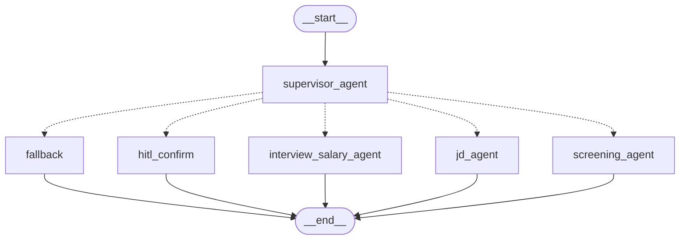

# RecruitAI

## 1. Project Overview
RecruitAI is a production-grade, multi-agent candidate intelligence platform that automates technical evaluations and seamlessly parses resumes. It solves the problem of biased and inefficient screening by enforcing blind evaluations and extracting structured data for unbiased, deterministic hiring decisions.

## 2. Features
- **Unbiased Candidate Screening (Blind Mode):** Automatically strips names, contact information, and demographic indicators from resumes before evaluation to ensure a purely signal-driven process.
- **Deterministic ATS-Ready Exports:** Enforces strictly typed JSON outputs from multi-agent evaluations, allowing for direct and seamless integration into existing Applicant Tracking Systems.
- **Side-by-Side Candidate Matrix:** Systematically compares candidates using role-specific grading rubrics that score resumes point-by-point.
- **Automated Outreach & Scheduling:** Dynamically generates highly personalized candidate engagement emails and secures interview slots instantly.
- **Semantic Candidate Matching:** Employs a Retrieval-Augmented Generation (RAG) pipeline utilizing query expansion and dense retrieval for precise candidate matching.

## 3. Tech Stack
- **Frontend:** Next.js 16 (App Router) for robust server-side rendering, Tailwind CSS for a premium minimalist design system, and GSAP & Framer Motion for fluid UI animations.
- **Backend:** FastAPI (Python) for asynchronous, high-performance API handling.
- **AI Orchestration:** LangGraph and LangChain for structured, multi-agent workflow routing and state management.
- **Vector Database:** Supabase (PostgreSQL with pgvector) for scalable semantic candidate search and storage.

## 4. Architecture
The platform utilizes a Supervisor-Worker agent architecture. A central Supervisor agent parses user intent and routes execution to specialized sub-agents.


```mermaid
graph TD;
	__start__([__start__]) --> supervisor_agent;
	supervisor_agent -.-> fallback;
	supervisor_agent -.-> hitl_confirm;
	supervisor_agent -.-> interview_salary_agent;
	supervisor_agent -.-> jd_agent;
	supervisor_agent -.-> screening_agent;
	fallback --> __end__([__end__]);
	hitl_confirm --> __end__;
	interview_salary_agent --> __end__;
	jd_agent --> __end__;
	screening_agent --> __end__;
```

## 5. Project Structure
- `backend/`: Contains the FastAPI application, LangGraph multi-agent orchestration logic, and vector database interactions.
- `backend/app/api/`: API route definitions categorized by functionality (chat, evaluation, ingestion, reports).
- `frontend/`: Next.js 16 frontend application featuring the React components and styling.
- `frontend/package.json`: Defines frontend dependencies including UI libraries and testing scripts.
- `backend/scripts/`: Contains utility scripts for database initialization.

## 6. Installation & Setup

### Prerequisites
- Python 3.9+
- Node.js 18+
- Supabase account and API keys

### Backend Setup
1. Create a virtual environment and install dependencies:
   ```bash
   python -m venv .venv
   source .venv/bin/activate
   pip install -r backend/requirements.txt
   ```
2. Configure environment variables (copy `backend/.env.example` to `backend/.env`):
   ```text
   GEMINI_API_KEY=your_gemini_key
   GROQ_API_KEY=your_groq_key
   TAVILY_API_KEY=your_tavily_key
   SUPABASE_URL=your_supabase_url
   SUPABASE_SERVICE_ROLE_KEY=your_service_role_key
   ```
3. Initialize Supabase tables:
   ```bash
   # Run the provided SQL script in your Supabase SQL editor
   cat backend/scripts/init_db.sql
   ```
4. Run the backend server:
   ```bash
   python backend/run.py
   ```

### Frontend Setup
1. Navigate to the frontend directory and install dependencies:
   ```bash
   cd frontend
   npm install
   ```
2. Start the development server:
   ```bash
   npm run dev
   ```
3. Open `http://localhost:3000` to interact with the platform.

## 7. Usage
1. **Upload Candidate Resumes:** Ingest candidate resumes (PDF or Word format) via the platform UI.
2. **Define Job Requirements:** Input the job description and evaluation rubrics for the AI agents to process.
3. **Review Blind Screens:** Analyze the parsed, anonymized resumes alongside the side-by-side evaluation matrix.
4. **Approve Actions:** Provide Human-in-the-Loop (HITL) confirmation to send out engagement emails or lock interview slots.
5. **Export Data:** Export the structured JSON evaluations directly to your preferred ATS.

## 8. Screenshots / Demo


- **PPT Presentation:** https://canva.link/vhjbsmm3ggyqaf6
- **Video Demo:** https://drive.google.com/drive/folders/1LqA2B1YfSbc-91-OUlOwBDksLj5RAYDc?usp=sharing

## 9. API Documentation
Key endpoints available in the backend service:

- `POST /candidates/evaluate`
  - **Description:** Persists recruiter rubric assessment scores and interview notes for a candidate.
  - **Required Parameters (Body):** `candidate_id` (string), `tech_score` (integer 1-5), `comm_score` (integer 1-5), `notes` (string).
  - **Expected Response:** JSON containing a success status and the saved evaluation data.

- `GET /candidates/{candidate_id}/evaluation`
  - **Description:** Retrieves recruiter rubric assessment scores and interview notes for a candidate.
  - **Required Parameters:** `candidate_id` in the URL path.
  - **Expected Response:** JSON containing evaluation scores and notes.

- `POST /export/ats`
  - **Description:** Generates server-side ATS export payloads (Greenhouse/Lever compliant).
  - **Required Parameters (Body):** `format` (string, e.g., "json").
  - **Expected Response:** JSON detailing the export formatting and total candidate evaluations count.

## 10. Engineering Decisions
- **Multi-Agent Orchestration over Monolith:** Utilized a LangGraph Supervisor-Worker architecture instead of a single massive prompt. This guarantees deterministic execution, strict state management, and easier debugging of individual tasks.
- **Graceful Model Failover:** Model connections are distributed across multiple providers (Gemini, Groq) using a round-robin strategy, ensuring high availability even during individual API outages.
- **Human-in-the-Loop (HITL) Safeguards:** High-stakes operations, such as sending candidate emails or locking interview calendar slots, are strictly gated behind explicit human confirmation to prevent automated errors.
- **Strict Data Validation:** Output from all agents is piped through rigorous Pydantic schema validation to ensure frontend components always receive perfectly typed data.

## 11. Testing
- **Frontend E2E and Unit Testing:** The frontend features automated test scripts. Run `npm run test` or `npm run test:e2e` inside the `frontend/` directory to execute Next.js oriented tests.
- **Backend Testing:** Python Pytest is set up for the backend. Tests can be run by navigating to the `backend/` directory and executing `pytest`.

## 12. Limitations & Future Improvements
- **Current Limitations:** The platform's RAG pipeline can occasionally struggle with highly stylized or image-heavy resumes that defy standard PDF text extraction. Real-time calendar synchronization currently acts as a placeholder system requiring manual finalization.
- **Future Improvements:** 
  - Implementation of multi-modal vision extraction (using models like Gemini 1.5 Pro) to parse complex, non-standard resume layouts accurately.
  - Direct integration with Google Calendar and Microsoft Graph APIs for true real-time, automated interview scheduling.
