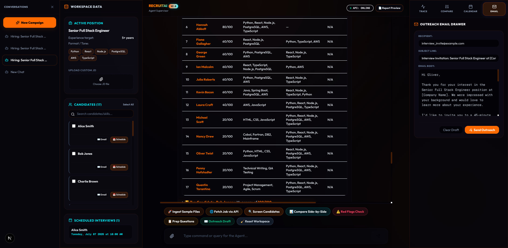
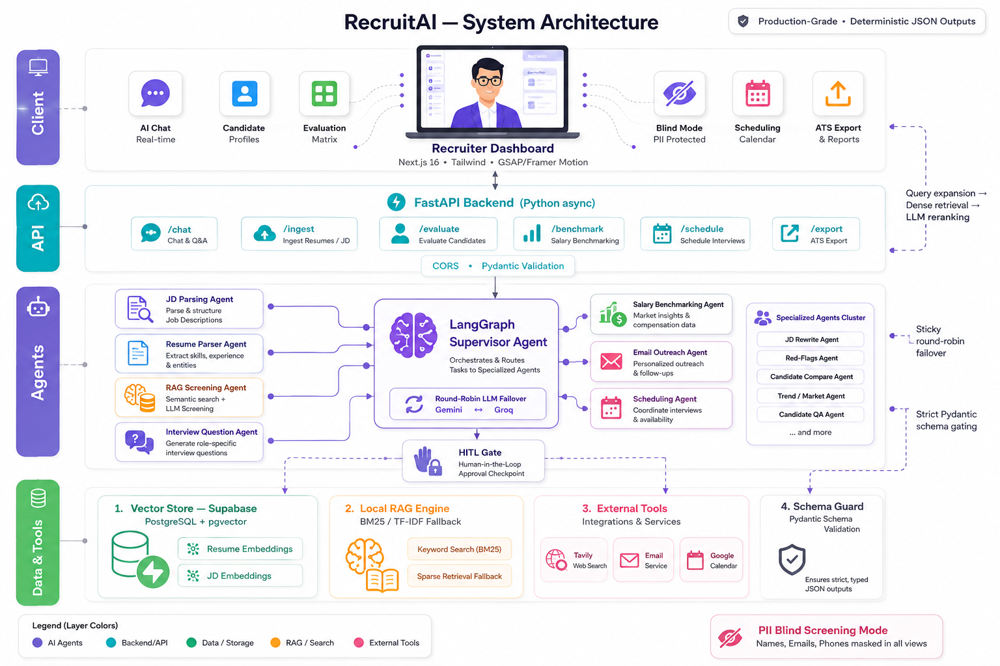
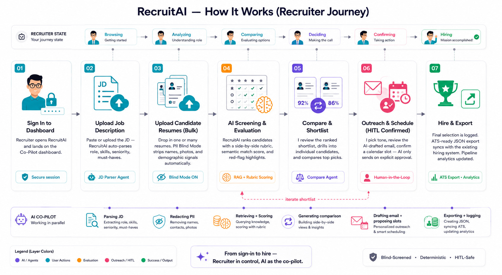
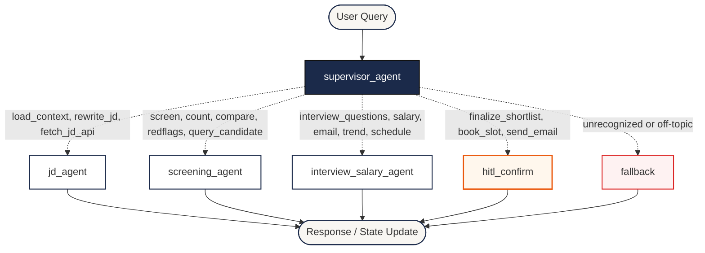

# RecruitAI — Multi-Agent Candidate Intelligence & Recruitment Automation Platform

<div align="center">

[](https://nextjs.org/)
[](https://react.dev/)
[](https://fastapi.tiangolo.com/)
[](https://langchain-ai.github.io/langgraph/)
[](https://supabase.com/)
[](https://www.python.org/)
[](https://www.typescriptlang.org/)
[](https://tailwindcss.com/)
[](LICENSE)

**An enterprise-grade, multi-agent hiring platform that automates technical candidate screening, enforces blind evaluations, delivers real-time recruitment intelligence, and integrates directly into ATS pipelines.**

[Live Demo Video](https://drive.google.com/drive/folders/1LqA2B1YfSbc-91-OUlOwBDksLj5RAYDc?usp=sharing) • [Presentation Deck](https://canva.link/vhjbsmm3ggyqaf6) • [Report Bug](https://github.com/Sri-dinesh/RecruitAI/issues) • [Request Feature](https://github.com/Sri-dinesh/RecruitAI/issues)

</div>

---

## Table of Contents
1. [Executive Overview](#1-executive-overview)
2. [Visual Architecture & Pipeline Diagrams](#2-visual-architecture--pipeline-diagrams)
3. [Core Feature Suite](#3-core-feature-suite)
4. [Multi-Agent LangGraph Architecture](#4-multi-agent-langgraph-architecture)
5. [Technology Stack](#5-technology-stack)
6. [Database Schema & Vector Search (pgvector)](#6-database-schema--vector-search-pgvector)
7. [Directory Structure](#7-directory-structure)
8. [Installation & Setup](#8-installation--setup)
9. [API Reference](#9-api-reference)
10. [Engineering Principles & Resilience](#10-engineering-principles--resilience)
11. [Testing & Verification](#11-testing--verification)
12. [Presentation & Demo Links](#12-presentation--demo-links)

---

## 1. Executive Overview

Modern technical recruiting suffers from critical bottlenecks: unstructured resumes, manual keyword parsing, cognitive recruiter fatigue, and unconscious demographic bias. 

**RecruitAI** replaces manual screening workflows with a **deterministic, multi-agent AI system**:
- **Eliminates Bias via Blind Mode:** Automatically redacts names, contact info, and demographic markers before evaluation, ensuring purely skill-driven assessments.
- **Supervisor-Worker Agent Coordination:** Employs LangGraph to coordinate specialized sub-agents for JD parsing, dense vector screening, interview question generation, salary benchmarking, and scheduling.
- **Advanced RAG (pgvector):** Leverages dense vector embeddings (`all-MiniLM-L6-v2`), query expansion, and cross-encoder relevance reranking to find the closest semantic fit between job requirements and applicant resumes.
- **Candidate Decision Pipeline:** Real-time action triggers to **Shortlist (✓)**, **Offer (★)**, or **Reject (✕)** candidates, synced to an enterprise PostgreSQL database.
- **Recruitment Intelligence & Analytics Dashboard:** Visualizes hiring velocity, pipeline funnels, candidate quality distribution, and skill demand via interactive Recharts visualizations.
- **Human-in-the-Loop (HITL) Safeguards:** Outbound recruiter emails and calendar reservations are strictly gated behind human approval.

---

## 2. Visual Architecture & Pipeline Diagrams

### 🖥️ Co-Pilot Workspace Dashboard


### 🏗️ System Architecture & Multi-Tenant Topology


### ⚡ Core AI Pipeline & Semantic Retrieval


### 🔄 End-to-End User Flow & How It Works


---

## 3. Core Feature Suite

### 1. Unbiased Candidate Screening (Blind Mode)
- Strips Personally Identifiable Information (PII) — full names, email addresses, phone numbers, geographic locations, and gendered indicators — prior to LLM evaluation.
- Evaluates applicants strictly against role-specific grading rubrics, scoring experience, tech stack proficiency, and measurable project impact.

### 2. Multi-Turn Conversational Co-Pilot
- Chat directly with your candidate pool using natural language prompts (*"Who has the strongest Kubernetes experience?"*, *"Compare top 3 candidates side-by-side"*, *"Check for timeline gaps in Bob's resume"*).
- Context-aware agent maintains conversational state, pronoun resolution (*"the top candidate"*, *"her"*), and multi-turn session history.

### 3. Candidate Decision Workflow
- One-click pipeline actions directly on candidate cards:
  - **Shortlist (✓):** Progress candidate to interview stages.
  - **Offer (★):** Mark candidate as hired / offer extended.
  - **Reject (✕):** Archive applicant with automated status tracking.
- Interactive status filter bar (`All`, `Shortlisted`, `Offered`, `Rejected`) to isolate candidate pools instantly.

### 4. Recruitment Analytics & Intelligence (`/analytics`)
- **Executive KPI Cards:** Total candidates, active jobs, screening rates, interview rates, offer conversion percentages, and average match scores with count-up animations.
- **Pipeline Funnel:** Step-by-step conversion funnel from initial application to offer acceptance.
- **Candidate Velocity & Ingestion:** Time-series area charts tracking ingestion volume across 7-day, 30-day, and 90-day lookback windows.
- **Quality Distribution Histogram:** Visual breakdown of candidates across 4 tiers (Top Tier 80-100%, Strong Fit 60-79%, Moderate 40-59%, Low Fit <40%).
- **Market Skill Demand:** Ranks top demanded skills parsed across all active job postings.
- **Hiring Velocity Metrics:** Tracks average days to shortlist, days to interview, and days to offer.
- **Interactive Jobs Summary:** Searchable, sortable table detailing candidate metrics and average match scores per role.
- **Live Activity Feed:** Reverse-chronological audit log of recruiter actions, status changes, and interview bookings.

### 5. Enterprise Authentication & Multi-Tenant Isolation
- **Authentication Providers:** Email/Password and Google OAuth sign-in.
- **Split-Screen `/auth` Page:** Responsive layout with animated floating AI preview cards, feature tickers, and spring physics tab transitions (`layoutId`).
- **Real-Time Password Strength Meter:** Evaluates password complexity with dynamic visual feedback bars.
- **Secure Password Reset Flow:** Dedicated `/auth/reset-password` route with deep-link hash token detection, 60s rate-limiting cooldown timers, and auto-redirect.
- **Strict Row-Level Security (RLS):** Supabase PostgreSQL policies guarantee that recruiters can only access their own jobs, candidate pools, and campaign sessions.

### 6. Automated Outreach & Scheduling
- Generates tailored outreach emails matching candidate experience to JD highlights with dynamic tone options (Professional, Casual, Direct).
- Resolves candidate availability, recommends optimal interview slots, and locks calendar meetings with Human-in-the-Loop approval.

### 7. ATS Exports & Executive Reporting
- Generates structured, deterministic JSON/CSV export payloads compatible with **Greenhouse**, **Lever**, and **Workday**.
- Generates corporate, publication-ready PDF recruitment reports via ReportLab.

---

## 4. Multi-Agent LangGraph Architecture

RecruitAI avoids fragile single-prompt LLM architectures by orchestrating specialized agents via **LangGraph**:


```mermaid
graph TD;
	__start__([User Query]) --> supervisor_agent;
	supervisor_agent -.->|load_context, rewrite_jd, fetch_jd_api| jd_agent;
	supervisor_agent -.->|screen, count, compare, redflags, query_candidate| screening_agent;
	supervisor_agent -.->|interview_questions, salary, email, trend, schedule| interview_salary_agent;
	supervisor_agent -.->|finalize_shortlist, book_slot, send_email| hitl_confirm;
	supervisor_agent -.->|unrecognized or off-topic| fallback;
	
	jd_agent --> __end__([Response / State Update]);
	screening_agent --> __end__;
	interview_salary_agent --> __end__;
	hitl_confirm --> __end__;
	fallback --> __end__;

	classDef default fill:#f8f6f2,stroke:#1b2a4a,stroke-width:1.5px;
	classDef supervisor fill:#1b2a4a,stroke:#111,color:#fff;
	classDef agent fill:#ffffff,stroke:#1b2a4a,stroke-width:1.5px;
	classDef hitl fill:#fff7ed,stroke:#ea580c,stroke-width:2px;
	classDef fallback fill:#fef2f2,stroke:#dc2626,stroke-width:1.5px;

	class supervisor_agent supervisor;
	class jd_agent,screening_agent,interview_salary_agent agent;
	class hitl_confirm hitl;
	class fallback fallback;
```

### Specialized Agents Overview

| Agent Node | Responsibilities | Handled Intents |
| :--- | :--- | :--- |
| **Supervisor Agent** | Parses user intent, resolves conversational pronouns (*"the top candidate"*, *"her"*), checks confidence thresholds, and routes requests. | Intent classification, turn routing |
| **JD Agent** | Ingests raw JD files (PDF/DOCX/TXT), restructures skills into Pydantic schemas, polishes JDs for startups, and fetches live job postings via APIs. | `load_context`, `rewrite_jd`, `fetch_jd_api` |
| **Screening & RAG Agent** | Performs vector semantic search over pgvector, scores candidates against rubrics, detects resume red flags/gaps, builds side-by-side matrices, and answers applicant Q&A. | `screen`, `count`, `compare`, `redflags`, `query_candidate` |
| **Interview & Salary Agent**| Generates technical interview questions targeted at candidate weaknesses, benchmarks market compensation, drafts candidate emails, and schedules meetings. | `interview_questions`, `salary`, `email`, `trend`, `schedule` |
| **HITL Confirm Agent** | Halts agent autonomous execution for high-stakes outbound actions (email dispatch, calendar locks) until explicit human sign-off (`yes`, `confirm`). | `finalize_shortlist`, `schedule_interview` |
| **Fallback Agent** | Graceful recovery for out-of-scope or low-confidence queries (< 0.60), presenting numbered quick-action options to guide the recruiter. | `other` |

---

## 5. Technology Stack

| Layer | Technologies | Purpose |
| :--- | :--- | :--- |
| **Frontend Framework** | **Next.js 16 (App Router)**, React 19, TypeScript | Server and client rendering, route grouping, typed API interactions |
| **Styling & Design System** | **Tailwind CSS v4**, Lucide React | Solid luxury minimalist aesthetic (#F8F6F2 solid canvas, #111111 ink headers, #1B2A4A slate accents) |
| **Motion & Micro-interactions**| **Framer Motion**, **GSAP** (ScrollTrigger) | Spring physics tab sliders, typewriter effect, floating preview cards, enter transitions |
| **Data Visualization** | **Recharts** | Pipeline funnels, area ingestion timelines, match score histograms, skill demand bars |
| **Backend API Server** | **FastAPI**, Uvicorn, Python 3.11+ | Asynchronous REST endpoints, multipart streaming, Pydantic data validation |
| **AI & Multi-Agent** | **LangGraph**, **LangChain**, Pydantic v2 | Stateful multi-agent graph orchestration, intent routing, structured JSON outputs |
| **LLM Inference & Failover** | **Google Gemini 2.5 Flash / 1.5 Pro**, **Groq (Llama 3.3 70B)** | High-throughput inference with sticky round-robin automatic provider failover |
| **Embeddings & Vector Store** | **sentence-transformers (`all-MiniLM-L6-v2`)**, **pgvector** | 384-dimensional dense semantic embeddings with cosine similarity distance |
| **Database & Auth** | **Supabase (PostgreSQL)**, Supabase Auth | Relational multi-tenant schema, Row-Level Security (RLS), JWT Bearer tokens |
| **Document Processing** | **pypdf**, **python-docx** | Robust plain text and metadata extraction from uploaded resumes and job descriptions |
| **Reporting & Search Tools** | **ReportLab**, **Tavily Search API** | PDF recruitment report generation and live web market salary/skill search |

---

## 6. Database Schema & Vector Search (pgvector)

RecruitAI uses a normalized, production-grade relational schema in PostgreSQL with Supabase:

```sql
-- 1. Core Relational Entities
public.jobs                 -- Normalized job postings (title, raw_jd, jd_structured, status)
public.candidates           -- Canonical applicant profile (full_name, email, raw_resume_text, metadata)
public.resume_chunks        -- 384-dim vector embeddings tied to candidates (IVFFlat indexed)
public.applications         -- Join table linking candidate <-> job with match scores & pipeline status
public.interviews           -- Scheduled interview slots (application_id, scheduled_at, duration, mode, link)
public.chat_sessions        -- Recruiter campaign sessions scoped to user_id and active job_id
public.chat_messages        -- Full conversational message history with turn metadata

-- 2. pgvector Match Function
CREATE OR REPLACE FUNCTION public.match_resume_chunks(
    query_embedding vector(384),
    match_threshold float,
    match_count int,
    filter_candidate_id uuid default null,
    filter_user_id uuid default null
) RETURNS TABLE (
    id uuid,
    candidate_id uuid,
    full_name text,
    chunk_text text,
    similarity float
) LANGUAGE sql STABLE ...

-- 3. Row-Level Security (RLS)
ALTER TABLE public.jobs ENABLE ROW LEVEL SECURITY;
CREATE POLICY "Users manage their own jobs" ON public.jobs
    FOR ALL USING (auth.uid() = user_id);
```

---

## 7. Directory Structure

```
RecruitAI/
├── backend/
│   ├── app/
│   │   ├── api/                     # REST API Routers
│   │   │   ├── routes_analytics.py  # KPI metrics, funnel, hiring velocity, charts
│   │   │   ├── routes_chat.py       # LangGraph chat & session state persistence
│   │   │   ├── routes_evaluate.py   # Rubric scoring & ATS export payloads
│   │   │   ├── routes_ingest.py     # PDF/DOCX resume & JD multipart ingestion
│   │   │   └── routes_reports.py    # ReportLab corporate PDF report generation
│   │   ├── core/                    # Core Infrastructure
│   │   │   ├── auth.py              # JWT Bearer token validator & user_id extractor
│   │   │   ├── config.py            # Environment settings and API key loader
│   │   │   ├── llm_router.py        # Gemini <-> Groq round-robin failover router
│   │   │   └── logging.py           # Turn tracer & agent latency logger
│   │   ├── graph/                   # LangGraph Multi-Agent Engine
│   │   │   ├── builder.py           # StateGraph assembly & conditional routing edges
│   │   │   ├── router_node.py       # Regex rule-checks + LLM intent classification
│   │   │   ├── state.py             # RecruitState typed dictionary definition
│   │   │   └── nodes/               # Specialized agent handlers
│   │   │       ├── parse_jd_node.py         # JD parsing & structuring
│   │   │       ├── screen_node.py           # Vector match scoring & Blind Mode
│   │   │       ├── compare_node.py          # Side-by-side comparison matrix
│   │   │       ├── redflags_node.py         # Employment gap & inconsistency audit
│   │   │       ├── interview_qgen_node.py   # Targeted interview question generator
│   │   │       ├── salary_node.py           # Market compensation benchmark
│   │   │       ├── email_node.py            # Personalized recruiter outreach
│   │   │       ├── schedule_node.py         # Calendar slot reservation
│   │   │       ├── hitl_confirm_node.py     # Human confirmation gate
│   │   │       └── candidate_qa_node.py     # Applicant deep-dive Q&A
│   │   ├── rag/                     # Retrieval-Augmented Generation
│   │   │   ├── advanced_rag.py      # Query expansion & cross-encoder reranking
│   │   │   ├── chunking.py          # Semantic boundary text chunker
│   │   │   ├── embeddings.py        # sentence-transformers (all-MiniLM-L6-v2)
│   │   │   ├── vector_store.py      # Supabase pgvector client integration
│   │   │   └── fallback_db.py       # SQLite drop-in fallback for offline development
│   │   ├── schemas/                 # Pydantic Schemas (Candidate, JobDescription)
│   │   └── services/                # Document parsers, API fetchers, report builder
│   ├── scripts/
│   │   ├── init_db.sql              # Normalized Postgres schema, RLS & RPC functions
│   │   └── generate_graph.py        # LangGraph visual Mermaid exporter
│   ├── tests/                       # Pytest test suite (auth, nodes, RAG, failover)
│   ├── Dockerfile                   # Container configuration
│   ├── Procfile                     # Render web service deployment configuration
│   └── requirements.txt             # Python package dependencies
│
├── frontend/
│   ├── src/
│   │   ├── app/
│   │   │   ├── layout.tsx           # Root layout with Fraunces/DM Sans & AuthProvider
│   │   │   ├── page.tsx             # Modular landing page (Hero, Features, Workflow)
│   │   │   ├── auth/                # Dedicated Split-Screen Authentication
│   │   │   │   ├── page.tsx         # /auth with interactive floating candidate card
│   │   │   │   ├── callback/        # Supabase OAuth and recovery redirect handler
│   │   │   │   └── reset-password/  # Password reset with live strength evaluation
│   │   │   ├── dashboard/           # Co-Pilot AI Recruiter Workspace
│   │   │   │   └── page.tsx         # Chat co-pilot, 3-panel layout, decision actions
│   │   │   └── analytics/           # Recruiter BI & Intelligence Dashboard
│   │   │       └── page.tsx         # Recharts KPI cards, funnel, velocity, tables
│   │   ├── components/
│   │   │   ├── AuthModal.tsx        # Spring physics auth modal with password meter
│   │   │   ├── MarkdownText.tsx     # Syntax-highlighted agent response renderer
│   │   │   ├── analytics/           # Modular analytics chart widgets
│   │   │   └── landing/             # Modular landing sections (Hero, Features, Stack)
│   │   ├── context/
│   │   │   └── AuthContext.tsx      # Supabase authentication context & session state
│   │   └── lib/
│   │       ├── apiClient.ts         # fetchWithAuth() wrapper with Bearer JWT tokens
│   │       ├── analyticsApi.ts      # Analytics data fetching layer
│   │       └── supabaseClient.ts    # Browser-safe Supabase client initialization
│   ├── package.json                 # Next.js 16, React 19, Tailwind, Recharts
│   └── tsconfig.json                # TypeScript compiler configuration
```

---

## 8. Installation & Setup

### Prerequisites
- **Python 3.10+**
- **Node.js 18+** & **npm** (or **pnpm**)
- **Supabase Account** (PostgreSQL with `vector` and `pgcrypto` extensions)
- API Keys for **Google Gemini**, **Groq**, and **Tavily**

---

### Step 1: Database Setup (Supabase)
1. Open your **Supabase Dashboard** -> **SQL Editor**.
2. Copy and execute the complete script located in:
   ```bash
   backend/scripts/init_db.sql
   ```
   *This initializes the normalized relational tables (`jobs`, `candidates`, `resume_chunks`, `applications`, `interviews`, `chat_sessions`, `chat_messages`), configures pgvector indexes, applies RLS policies, and registers the analytics RPC functions.*

---

### Step 2: Backend Setup (FastAPI)
1. Navigate to the `backend/` directory:
   ```bash
   cd backend
   ```
2. Create and activate a Python virtual environment:
   ```bash
   python3 -m venv .venv
   source .venv/bin/activate
   ```
3. Install dependencies:
   ```bash
   pip install -r requirements.txt
   ```
4. Configure environment variables (create `backend/.env` from `.env.example`):
   ```env
   # LLM API Keys
   GEMINI_API_KEY=your_gemini_api_key
   GROQ_API_KEY=your_groq_api_key

   # Search API Key
   TAVILY_API_KEY=your_tavily_api_key

   # Supabase Credentials
   SUPABASE_URL=https://your-project-id.supabase.co
   SUPABASE_ANON_KEY=your_supabase_anon_key
   SUPABASE_SERVICE_ROLE_KEY=your_supabase_service_role_key
   SUPABASE_JWT_SECRET=your_supabase_jwt_secret

   # Auth Mode (Set to "false" for production JWT authentication)
   USE_LOCAL_AUTH=false

   # Optional External APIs & SMTP
   SERPAPI_API_KEY=
   APILAYER_API_KEY=
   SMTP_SERVER=smtp.gmail.com
   SMTP_PORT=587
   SMTP_USERNAME=
   SMTP_PASSWORD=
   SMTP_SENDER=
   ```
5. Launch the backend server:
   ```bash
   python run.py
   # Or directly with Uvicorn:
   uvicorn app.main:app --host 0.0.0.0 --port 8000 --reload
   ```
   *The interactive API documentation will be available at `http://localhost:8000/docs`.*

---

### Step 3: Frontend Setup (Next.js)
1. Navigate to the `frontend/` directory:
   ```bash
   cd ../frontend
   ```
2. Install npm dependencies:
   ```bash
   npm install
   ```
3. Configure environment variables (create `frontend/.env.local`):
   ```env
   NEXT_PUBLIC_SUPABASE_URL=https://your-project-id.supabase.co
   NEXT_PUBLIC_SUPABASE_ANON_KEY=your_supabase_anon_key
   NEXT_PUBLIC_BACKEND_URL=http://localhost:8000
   ```
4. Start the Next.js development server:
   ```bash
   npm run dev
   ```
5. Open `http://localhost:3000` in your browser.

---

## 9. API Reference

All protected endpoints require an `Authorization: Bearer <supabase_jwt_token>` header.

### 💬 Multi-Agent Chat & Campaign State

| Method | Endpoint | Description |
| :--- | :--- | :--- |
| `POST` | `/api/chat` | Executes the LangGraph multi-agent pipeline with user message and returns structured state updates. |
| `GET` | `/api/sessions` | Lists all campaign sessions belonging to the authenticated recruiter, sorted by `updated_at`. |
| `POST` | `/api/sessions` | Creates a new blank hiring campaign session. |
| `GET` | `/api/sessions/{id}` | Fetches full hydrated session state (JD, candidates, shortlist, interviews, chat history). |
| `PATCH` | `/api/sessions/{id}` | Updates session attributes (e.g. title renaming). |
| `DELETE` | `/api/sessions/{id}` | Permanently removes a campaign session with cascade deletes. |

### 📂 Ingestion & Parsing

| Method | Endpoint | Description |
| :--- | :--- | :--- |
| `POST` | `/api/ingest/upload-jd` | Multipart upload (PDF, DOCX, TXT) for JDs; parses text and outputs structured schema. |
| `POST` | `/api/ingest/upload` | Multipart upload for resumes; extracts text, generates vector embeddings, and stores in pgvector. |

### 📊 Analytics & Intelligence

| Method | Endpoint | Description |
| :--- | :--- | :--- |
| `GET` | `/api/analytics/summary` | Returns total candidate metrics, job counts, and computed conversion rates (screening, interview, offer). |
| `GET` | `/api/analytics/pipeline` | Returns applicant counts and conversion percentages per pipeline stage. |
| `GET` | `/api/analytics/candidates-over-time?days=30` | Returns daily time-series candidate ingestion counts for lookback windows (7–365 days). |
| `GET` | `/api/analytics/match-distribution` | Returns histogram bucket counts for candidate quality score tiers. |
| `GET` | `/api/analytics/top-skills?top_n=12` | Returns ranked demand counts for technical skills extracted across job postings. |
| `GET` | `/api/analytics/hiring-velocity` | Returns average days to shortlist, days to interview, and days to offer. |
| `GET` | `/api/analytics/jobs-summary` | Returns per-job aggregate statistics (applied, shortlisted, interviewed, offered, avg match score). |
| `GET` | `/api/analytics/recent-activity?limit=20` | Returns a reverse-chronological audit log of recruitment pipeline events. |

### 🎯 Candidate Decisions, Reports & Actions

| Method | Endpoint | Description |
| :--- | :--- | :--- |
| `POST` | `/api/candidates/evaluate` | Saves rubric tech score (1-5), communication score (1-5), and recruiter notes. |
| `GET` | `/api/candidates/{id}/evaluation` | Retrieves existing recruiter rubric assessments for an applicant. |
| `POST` | `/api/reports/generate` | Generates a downloadable corporate PDF report via ReportLab based on session state. |
| `POST` | `/api/email/send` | Dispatches personalized candidate outreach emails via configured SMTP. |
| `POST` | `/api/export/ats` | Generates Greenhouse, Lever, and Workday compliant ATS JSON/CSV export payloads. |

---

## 10. Engineering Principles & Resilience

1. **Sticky Round-Robin LLM Failover:**
   To insulate against provider rate limits and transient outages, the LLM router dynamically distributes requests between **Google Gemini** and **Groq (Llama 3.3)**. If provider A fails, the router automatically fails over to provider B without degrading the user session.
2. **Deterministic Output Guarantees:**
   All agent node outputs are validated through **Pydantic schemas** with strict JSON-mode enforcement, preventing schema drift or malformed responses from reaching the UI.
3. **Multi-Tenant Row-Level Security:**
   PostgreSQL RLS ensures complete isolation between recruiter accounts. Tokens are validated at the FastAPI boundary via `jose.jwt`, extracting `auth.uid()` and guaranteeing User A cannot read or modify User B's campaigns.
4. **Dual Database Architecture (Cloud + SQLite Fallback):**
   When `USE_LOCAL_AUTH=true` or Supabase credentials are not supplied, the backend seamlessly switches to an embedded SQLite mirror (`FallbackSupabaseClient`), enabling full offline development without cloud dependencies.
5. **Human-in-the-Loop (HITL) Execution Gates:**
   Irreversible actions (candidate rejection notices, interview invites, calendar locks) require explicit user confirmation through interactive chat prompts before execution.

---

## 11. Testing & Verification

### Backend Testing Suite (Pytest)
The backend test suite covers authentication, multi-tenant isolation, LangGraph agent routing, LLM failover, and RAG retrieval:
```bash
cd backend
pytest -v
```

Key test modules:
- `tests/test_auth.py`: Verifies 401 unauthenticated rejections and cross-tenant session access denial.
- `tests/test_nodes.py`: Unit tests for JD parsing, scoring, salary benchmarking, and red flag nodes.
- `tests/test_failover.py`: Simulates API outages to verify Gemini <-> Groq automatic failover.
- `tests/test_advanced_rag.py`: Verifies dense vector similarity search and reranking.

### Frontend Quality & Type Checks
```bash
cd frontend
# TypeScript verification
npx tsc --noEmit

# Production Next.js build
npm run build
```

---

## 12. Presentation & Demo Links

- **Interactive Canva Presentation:** [View Slide Deck](https://canva.link/vhjbsmm3ggyqaf6)
- **Full Video Demonstration:** [Watch Video Walkthrough](https://drive.google.com/drive/folders/1LqA2B1YfSbc-91-OUlOwBDksLj5RAYDc?usp=sharing)
- **GitHub Repository:** [Sri-dinesh/RecruitAI](https://github.com/Sri-dinesh/RecruitAI)

---

<div align="center">

Built with precision by **Sri-dinesh** for modern talent teams.  
*RecruitAI — The Intelligence Layer for Modern Recruiting.*

</div>
