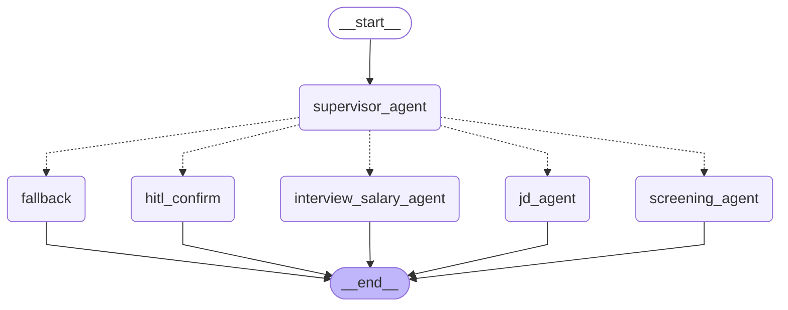

# RecruitAI Multi-Agent Workflow Graph

Below is the Mermaid representation of the Multi-Agent Supervisor LangGraph:

```mermaid
---
config:
  flowchart:
    curve: linear
---
graph TD;
	__start__([<p>__start__</p>]):::first
	supervisor_agent(supervisor_agent)
	jd_agent(jd_agent)
	screening_agent(screening_agent)
	interview_salary_agent(interview_salary_agent)
	hitl_confirm(hitl_confirm)
	fallback(fallback)
	__end__([<p>__end__</p>]):::last
	__start__ --> supervisor_agent;
	supervisor_agent -.-> fallback;
	supervisor_agent -.-> hitl_confirm;
	supervisor_agent -.-> interview_salary_agent;
	supervisor_agent -.-> jd_agent;
	supervisor_agent -.-> screening_agent;
	fallback --> __end__;
	hitl_confirm --> __end__;
	interview_salary_agent --> __end__;
	jd_agent --> __end__;
	screening_agent --> __end__;
	classDef default fill:#f2f0ff,line-height:1.2
	classDef first fill-opacity:0
	classDef last fill:#bfb6fc

```
